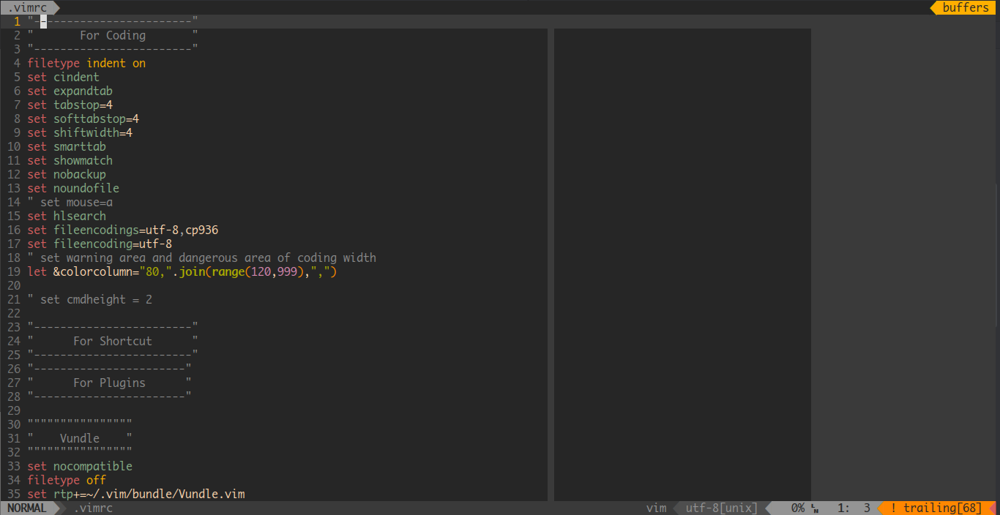

# My vimrc
This is the vimrc file I am currently using. It requires vim 7.3 or later version to support some of the plugins.
## Screenshot

## Installation
Just run the following command
```sh
git clone https://github.com/fingertap/vimrc.git ${HOME}/vimconfig
ln -s ${HOME}/vimconfig/.vimrc ${HOME}/.vimrc
ln -s ${HOME}/vimconfig/.ycm_extra_conf.py ${HOME}/.ycm_extra_conf.py
mkdir -p ${HOME}/.vim/bundle
git clone https://github.com/VundleVim/Vundle.vim ${HOME}/.vim/bundle/Vundle.vim
```
Then open vim and run `:PluginInstall`. After installation of all plugins, install `ctags` for `tagbar` plugin. On Arch linux
```
sudo pacman -S ctags
```
Ubuntu
```
sudo apt-get install ctags
```
CentOS
```
sudo yum install ctags
```
Install the patched [Monaco font](https://gist.github.com/baopham/1838072) to enable the arrows in `vim-airline`.
Notice that in CentOS you may need to compile a vim with version later than 7.3 to get all features of plugins working.
Next you need to compile `YouCompleteMe` as stated [here](https://github.com/Valloric/YouCompleteMe).
